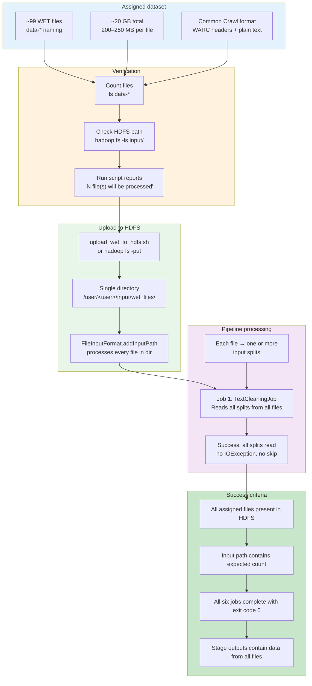
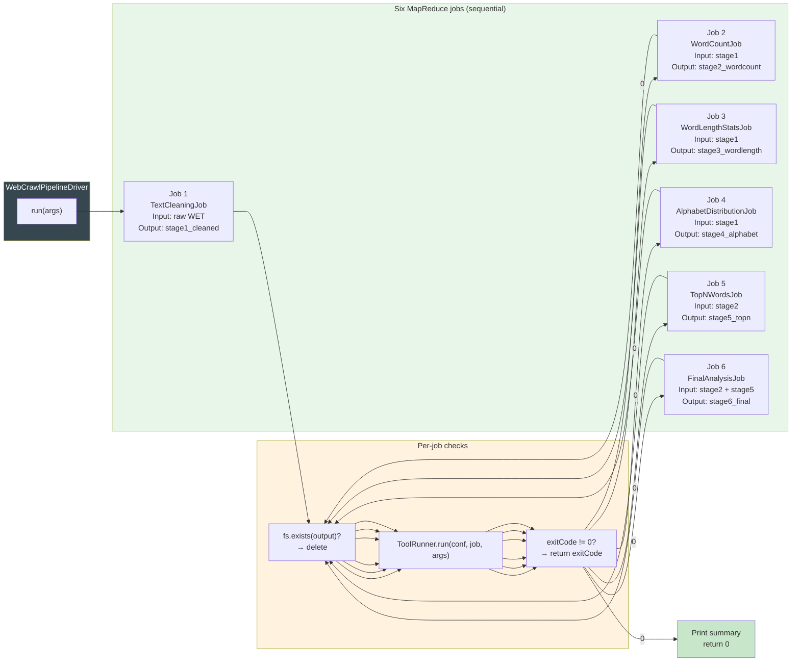
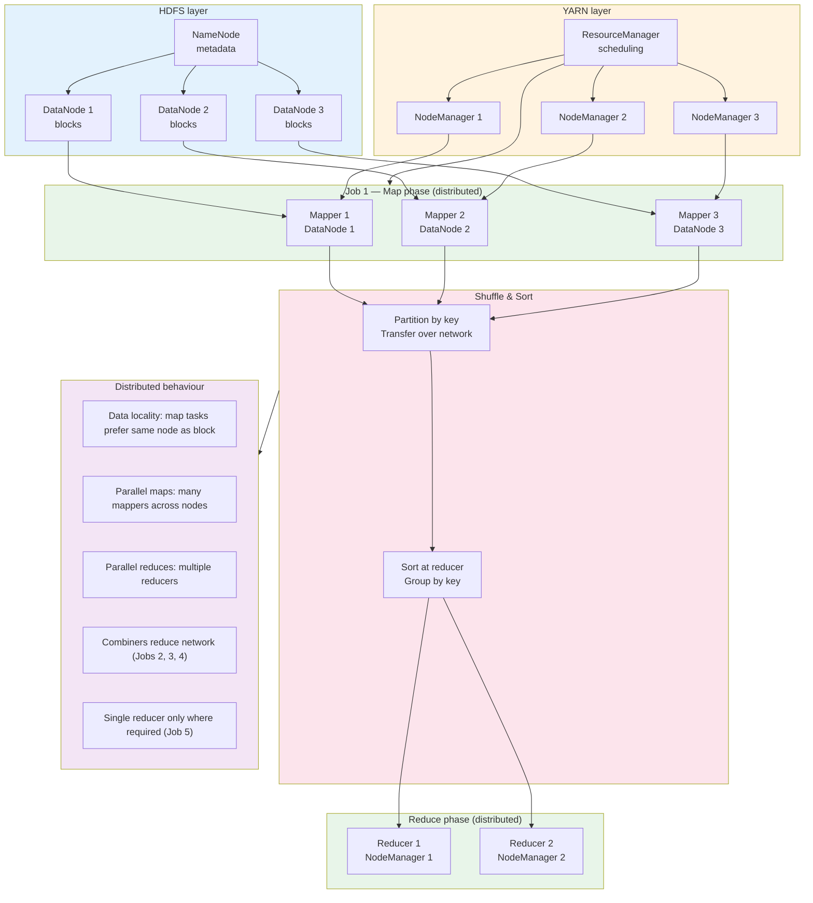

# Execution Expectations — Detailed Diagrams

This document illustrates the four execution expectations for the Hadoop Web Crawl Processing Pipeline, each with a **detailed Mermaid diagram**. Render the diagrams on GitHub (native Mermaid support), in [Mermaid Live](https://mermaid.live), or in VS Code with a Mermaid extension.

---

## 1. Successful Processing of Assigned WET Files

Assigned WET files must be fully and correctly processed: from availability on disk through HDFS upload to consumption by the pipeline, with no files skipped and no silent failures.



**Summary:** Assigned WET files are verified, uploaded to one HDFS directory, and processed in full by the pipeline. The run script reports the input file count; the Driver uses `FileInputFormat.addInputPath(conf, inputDir)`, so every file in that directory is included in the job input.

---

## 2. Execution of All Six MapReduce Jobs

All six MapReduce jobs must execute in order; each job must complete successfully before the next starts. Failure of any job stops the pipeline and returns a non-zero exit code.



**Execution order (enforced by Driver):**

| Step | Job class              | Input              | Output          |
|------|------------------------|--------------------|-----------------|
| 1    | TextCleaningJob        | WET path           | stage1_cleaned  |
| 2    | WordCountJob           | stage1_cleaned     | stage2_wordcount|
| 3    | WordLengthStatsJob     | stage1_cleaned     | stage3_wordlength |
| 4    | AlphabetDistributionJob| stage1_cleaned    | stage4_alphabet |
| 5    | TopNWordsJob           | stage2_wordcount   | stage5_topn     |
| 6    | FinalAnalysisJob       | stage2 + stage5    | stage6_final    |

Each job runs only after the previous one has finished successfully (`job.waitForCompletion(true)`). The Driver does not start Job 2 until Job 1 returns 0, and so on for all six jobs.

---

## 3. Distributed Processing Behaviour

The pipeline exhibits distributed processing: multiple mappers and reducers run on cluster nodes, data is read from HDFS with locality where possible, and the shuffle phase moves intermediate data across the network. No single node performs all work.



**How distribution is achieved:**

- **Input splits:** Each WET file (or block) becomes one or more input splits; each split is assigned to one map task.
- **Map tasks:** Many map tasks run in parallel on different nodes; Hadoop schedules them close to the data when possible.
- **Combiners:** Jobs 2, 3, and 4 use combiners so that partial aggregation happens on the map side, reducing data sent to reducers.
- **Shuffle:** Key-value pairs are partitioned (e.g. by hash of key), sent over the network, and sorted at the reducer.
- **Reduce tasks:** Multiple reducers (configurable; Job 5 uses one by design) run in parallel and write to HDFS.
- **No single point of work:** No single node runs all mappers or all reducers; the workload is spread across the cluster.

---

## 4. Proper Pipeline Orchestration via Driver Class

The Driver class is the single entry point that orchestrates the entire pipeline: it validates arguments, configures the job sequence, manages HDFS paths, runs each job, and enforces success/failure semantics.

```mermaid
sequenceDiagram
    participant User
    participant Main as main()
    participant Driver as WebCrawlPipelineDriver
    participant FS as FileSystem
    participant J1 as TextCleaningJob
    participant J2 as WordCountJob
    participant J3 as WordLengthStatsJob
    participant J4 as AlphabetDistributionJob
    participant J5 as TopNWordsJob
    participant J6 as FinalAnalysisJob

    User->>Main: hadoop jar ... WebCrawlPipelineDriver input output
    Main->>Driver: ToolRunner.run(conf, driver, args)
    Driver->>Driver: args.length != 2 ? return -1
    Driver->>FS: FileSystem.get(conf)
    Driver->>Driver: Print "PIPELINE STARTING"<br/>input path, output path

    rect rgb(232, 245, 233)
        Driver->>Driver: job1Output = outputBasePath + "/stage1_cleaned"
        Driver->>FS: fs.exists(job1Output)? fs.delete(..., true)
        Driver->>J1: ToolRunner.run(conf, TextCleaningJob, [input, job1Output])
        J1-->>Driver: exitCode
        alt exitCode != 0
            Driver->>User: "Job 1 failed!" ; return exitCode
        end
    end

    rect rgb(227, 242, 253)
        Driver->>FS: fs.exists(job2Output)? fs.delete(...)
        Driver->>J2: ToolRunner.run(conf, WordCountJob, [job1Output, job2Output])
        J2-->>Driver: exitCode
        alt exitCode != 0
            Driver->>User: "Job 2 failed!" ; return exitCode
        end
    end

    Driver->>J3: ToolRunner.run(WordLengthStatsJob, ...)
    J3-->>Driver: exitCode
    Driver->>J4: ToolRunner.run(AlphabetDistributionJob, ...)
    J4-->>Driver: exitCode
    Driver->>J5: ToolRunner.run(TopNWordsJob, ...)
    J5-->>Driver: exitCode
    Driver->>J6: ToolRunner.run(FinalAnalysisJob, [job2, job5, job6Output])
    J6-->>Driver: exitCode

    alt any exitCode != 0
        Driver->>User: "Job N failed!" ; return exitCode
    end

    Driver->>Driver: Print "PIPELINE COMPLETED SUCCESSFULLY"<br/>Print all output locations
    Driver->>Main: return 0
    Main->>User: System.exit(0)
```

**Orchestration responsibilities of the Driver:**

| Responsibility | Implementation |
|----------------|----------------|
| **Argument validation** | `args.length != 2` → print usage, return -1 |
| **Configuration** | `getConf()` passed to each job via ToolRunner |
| **HDFS path setup** | Fixed names: stage1_cleaned, stage2_wordcount, … stage6_final |
| **Output cleanup** | Before each job: `if (fs.exists(output)) fs.delete(output, true)` |
| **Sequential execution** | Jobs run one after another; next job only if previous returns 0 |
| **Failure handling** | On non-zero return: print "Job N failed!", return that code |
| **Summary** | On success: print all stage output paths |

The Driver does not implement map/reduce logic; it only invokes the six job classes and controls the workflow. Pipeline orchestration is therefore centralized and explicit in `WebCrawlPipelineDriver.run(String[] args)`.
